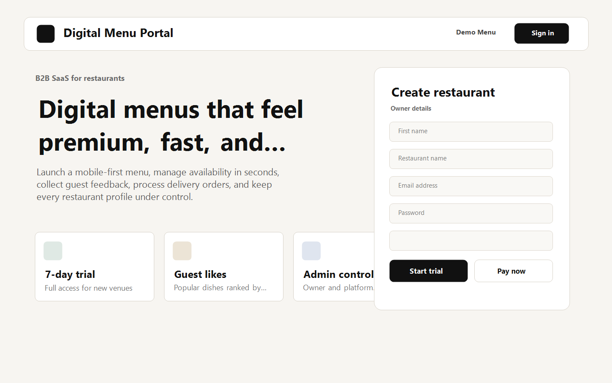
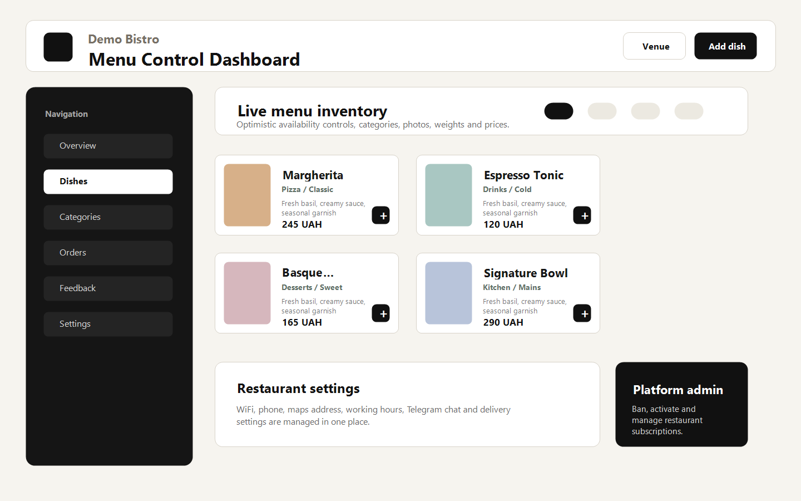
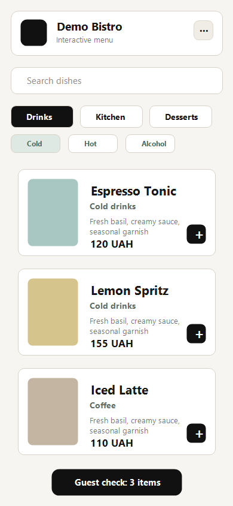

# Digital Menu Portal


Premium fullstack SaaS platform for restaurants that need a fast, mobile-first digital menu with owner dashboards, realtime availability controls, guest likes, feedback, delivery orders, and subscription payments.

The project is built as a production-style monorepo with a React client and Laravel REST API. It is designed to look and behave like a real B2B product, not a training exercise.

## ✨ Features

- Restaurant owner registration with trial or payment flow
- Mobile-first interactive restaurant menu
- Category and subcategory navigation
- Dish cards with vertical photos, price, ingredients, weight, likes, and add-to-check button
- Guest favorites stored in browser localStorage
- Popular dishes section sorted by likes
- Waiter-friendly guest check and delivery checkout path
- Admin dashboard for menu, dish, category, and venue settings
- Instant optimistic UI for dish availability changes
- Image upload and crop flow for dish photos
- Venue info panel with WiFi, working hours, phone, address, delivery, and feedback
- Platform admin area for managing restaurants, bans, statuses, and subscriptions
- Monobank payment invoice endpoint
- Telegram notifications for feedback and delivery orders
- Google Places-ready address autocomplete
- Fully responsive layout for mobile, tablet, and desktop

## 🧱 Tech Stack

**Frontend**

- React 18
- TypeScript
- Vite
- Tailwind CSS
- Framer Motion
- Lucide React icons

**Backend**

- PHP 8.4
- Laravel
- Laravel Sanctum
- REST API architecture
- Telegram Bot API integration
- Monobank acquiring integration

**Database and Infrastructure**

- MySQL 8
- Docker Compose
- Local file storage for uploaded images

## 🖼️ Screenshots

### Home Page



### Admin Dashboard



### Mobile Menu



## 🧭 Architecture

```text
digital-menu-portal/
├── frontend/             # React + TypeScript client
│   ├── src/
│   ├── public/
│   └── package.json
│
├── backend/              # Laravel REST API
│   ├── app/
│   ├── database/
│   ├── routes/
│   └── composer.json
│
├── screenshots/          # Portfolio screenshots
├── docker-compose.yml
├── package.json          # Root helper scripts
├── README.md
└── .gitignore
```

## 🔌 API Highlights

```text
POST   /api/auth/login
POST   /api/owners/register
GET    /api/company
PATCH  /api/company

GET    /api/restaurants/{slug}/menu
GET    /api/restaurants/{slug}/menu/version
POST   /api/restaurants/{slug}/feedback
POST   /api/restaurants/{slug}/delivery-orders
POST   /api/dishes/{dish}/like

POST   /api/dishes
PATCH  /api/dishes/{dish}
PATCH  /api/dishes/{dish}/toggle
DELETE /api/dishes/{dish}

POST   /api/payments/subscription
POST   /api/payments/monobank/webhook

GET    /api/platform/companies
PATCH  /api/platform/companies/{company}
DELETE /api/platform/companies/{company}
```

## 🚀 Getting Started

### 1. Clone the repository

```bash
git clone https://github.com/sashik117/MenuPortal.git
cd MenuPortal
```

### 2. Configure environment files

```bash
cp backend/.env.example backend/.env
cp frontend/.env.example frontend/.env
```

Set the required keys when you need external integrations:

```env
VITE_API_URL=http://127.0.0.1:8000/api
VITE_GOOGLE_PLACES_API_KEY=

TELEGRAM_BOT_TOKEN=
MONOBANK_TOKEN=
RESEND_API_KEY=
CONTACT_MAIL_TO=
```

### 3. Start backend and database

```bash
npm run docker:up
```

### 4. Start frontend

```bash
npm run dev:client
```

The app will be available at:

```text
Frontend: http://127.0.0.1:5174
API:      http://127.0.0.1:8000/api
```

## 🔐 Demo Accounts

```text
Restaurant owner:
login:    admin
password: admin12345

Platform admin:
login:    superadmin
password: superadmin12345
```

## ✅ Quality Checks

```bash
npm run lint:client
npm run build:client
npm run test:server
```

## 🧩 Product Logic

- Restaurants can start a 7-day trial or move into a payment flow.
- Expired trial restaurants receive a subscription-required response.
- Hidden dishes are removed from the public menu instead of being greyed out.
- Guest likes are stored both locally and in the API to prevent easy repeated likes.
- Admin availability changes use optimistic UI for instant visual feedback.
- Public menus use cached data and menu version checks for lightweight realtime updates.

## 🌍 Live Demo

Deployment is planned. The project is already structured for separate frontend and backend deployment.

## 👩‍💻 Contact

- GitHub: [@sashik117](https://github.com/sashik117)
- Telegram: `@sashik117`

---

Built as a portfolio-ready fullstack SaaS project with a clean architecture, premium UI direction, and real business logic.
